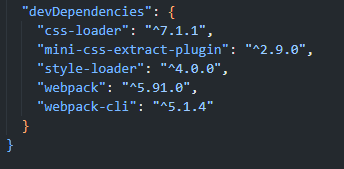
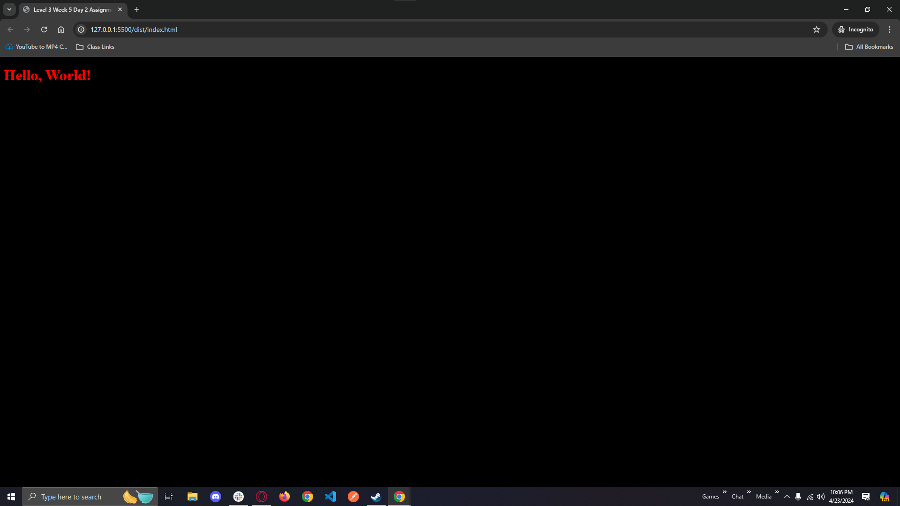

# Objective

The goal of this assignment is to deepen your understanding of Webpack loaders and plugins. You will configure Webpack to process CSS files using style-loader and css-loader and then optimize the CSS output for production using the MiniCssExtractPlugin.

# Instructions

## Part 1: Project Setup

### Initialize Your Project:

- If not already done, create a new directory named webpack-loaders-plugins.
- Inside this directory, initialize a new npm project with npm init -y.

### Install Webpack and Loaders:

- Install Webpack, Webpack CLI, style-loader, and css-loader as development dependencies.
    

### Project Structure:

- Create a src directory with an index.js file and a styles.css file inside it.
- Also, create an index.html file.
    
    

## Part 2: Configure Loaders

### Webpack Configuration:

- Create a webpack.config.js file in your project root.
- Configure the entry point as ./src/index.js and the output as bundle.js in the dist directory.
    

### CSS Loaders:

- In your webpack.config.js, add a rule to use style-loader and css-loader for .css files.

## Part 3: Implement CSS in Your Application

### Adding CSS:

- In src/styles.css, add some CSS styles of your choice.
- Import styles.css in your src/index.js file.
    
    

### HTML Setup:

- Link your bundled JavaScript file in dist/index.html.
    

## Part 4: Install and Configure MiniCssExtractPlugin

### Install the Plugin:

- Install mini-css-extract-plugin as a development dependency.
  

### Plugin Configuration:

- Modify your webpack.config.js to use MiniCssExtractPlugin for extracting CSS into separate files.
- Replace style-loader with MiniCssExtractPlugin.loader.
    

## Part 5: Building for Production

### Production Build:

- Add a script in your package.json to create a production build using Webpack ("build": "webpack --mode=production").
- Run the build script to generate your production files.
    

### Testing Your Build:

- Open dist/index.html in a browser to ensure that the external CSS file is loaded and applied correctly.
  
